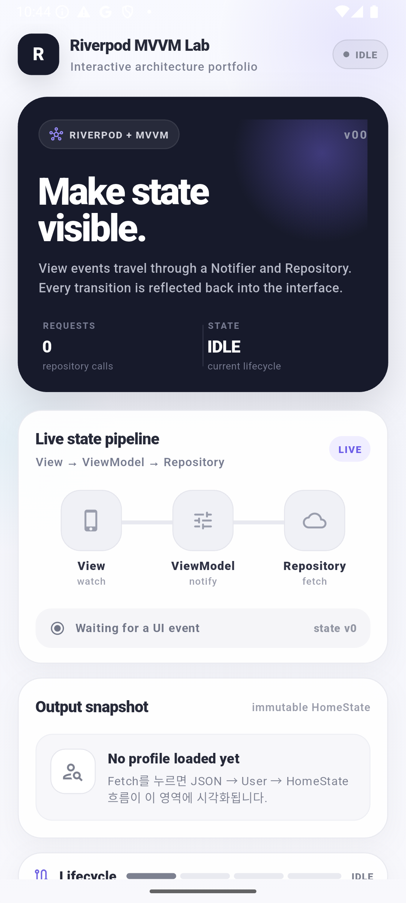
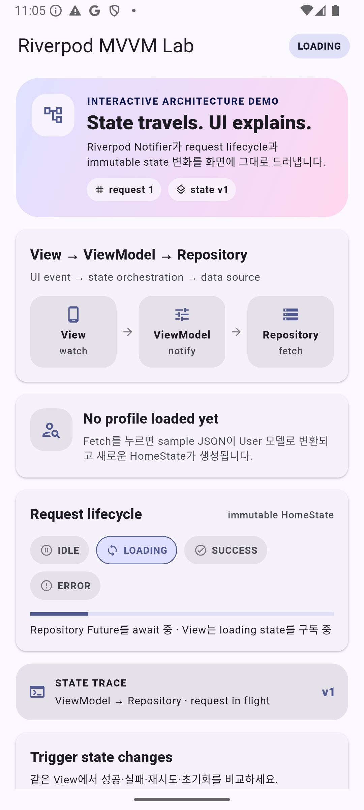
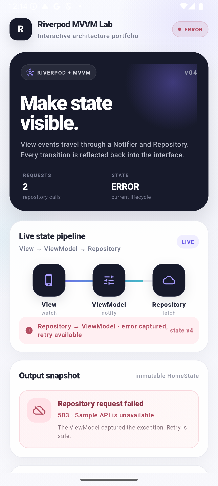

# Flutter Riverpod MVVM Architecture Lab

An interactive Flutter portfolio app that visualizes how state moves through **View → ViewModel → Repository** with Riverpod `Notifier` and MVVM.

Riverpod `Notifier`와 MVVM 구조에서 **View → ViewModel → Repository**로 상태가 이동하는 과정을 UI에서 직접 확인할 수 있도록 만든 Flutter 포트폴리오 앱입니다.

## Preview

<table>
  <tr>
    <td align="center"><strong>Idle</strong></td>
    <td align="center"><strong>Loading</strong></td>
  </tr>
  <tr>
    <td align="center"></td>
    <td align="center"></td>
  </tr>
  <tr>
    <td align="center"><strong>Success</strong></td>
    <td align="center"><strong>Error / Retry</strong></td>
  </tr>
  <tr>
    <td align="center"></td>
    <td align="center"></td>
  </tr>
</table>

Captured from an Android Emulator after performing the actual interactions shown in each state.
각 이미지는 Android Emulator에서 해당 상태로 실제 interaction을 수행한 뒤 캡처했습니다.

## What it does / 주요 기능

- **Interactive lifecycle** — `Fetch`, `Refresh`, `Simulate error`, `Reset`으로 `idle → loading → success / error` 흐름을 직접 전환합니다.
- **Repository flow** — sample JSON을 `User` 모델로 변환하고 Repository 결과를 immutable `HomeState`에 반영합니다.
- **Visible state metadata** — `request count`, `state version`, `last updated`, data source를 화면에서 바로 확인할 수 있습니다.
- **Success & error handling** — success에서는 sample profile을 표시하고, error에서는 ViewModel이 잡은 repository exception과 retry 가능 상태를 보여줍니다.

## Architecture / 구조

```text
View (ConsumerWidget)
        │ watch / user event
        ▼
ViewModel (Notifier<HomeState>)
        │ async request
        ▼
Repository
        │ User / error
        └──────────────► immutable HomeState ──► View rebuild
```

- **View** — `ConsumerWidget` watches `homeViewModelProvider`. / `ConsumerWidget`가 `homeViewModelProvider`를 구독합니다.
- **ViewModel** — `Notifier<HomeState>` owns request orchestration and lifecycle transitions. / `Notifier<HomeState>`가 request orchestration과 loading/success/error 전환을 담당합니다.
- **Repository** — provides asynchronous sample JSON and a simulated 503 error path. / 비동기 sample JSON 응답과 의도적인 503 sample error를 제공합니다.

## Tech Stack / 기술 스택

- Flutter / Dart
- Riverpod (`flutter_riverpod` 2.6.1)
- Material 3
- Flutter widget tests

## Run / 실행

```bash
flutter pub get
flutter run
```

No external API key or credential is required; the app runs with the included sample repository.
외부 API key나 별도 credential 없이 포함된 sample repository만으로 실행할 수 있습니다.

## Validation / 검증

The following checks were completed during the portfolio polish pass.
포트폴리오 마무리 과정에서 아래 항목을 실제로 검증했습니다.

- `flutter analyze` — **No issues found**
- `flutter test` — **3/3 tests passed**
- Android Emulator — verified idle, loading, success, and error interactions on Android 15 / API 35
- Android debug build — successfully generated `build/app/outputs/flutter-apk/app-debug.apk`
- Emulator runtime — no RenderFlex overflow or Flutter runtime exception observed
