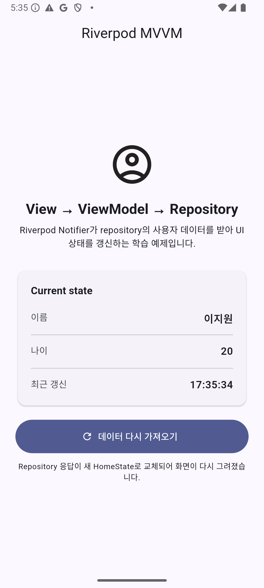

# Flutter Riverpod MVVM Practice

Riverpod의 `Notifier`/`ProviderScope`를 사용해 **View → ViewModel → Repository** 흐름을 연습한 작은 Flutter MVVM 학습 프로젝트입니다.

A compact Flutter learning project for practicing a **View → ViewModel → Repository** flow with Riverpod-managed state.

## UI Preview / 구현 화면



위 이미지는 Android Emulator에서 기본 `lib/main.dart`를 실행하고 **사용자 데이터 가져오기**를 눌러 ViewModel 상태가 실제로 갱신된 화면을 캡처한 것입니다.

This preview is captured from the default app entrypoint on an Android Emulator after fetching the sample repository data, so the Riverpod state update is visible in the UI.

## What I Practiced / 학습 내용

- `ProviderScope`를 통한 Riverpod 상태 관리 진입점 구성
- `NotifierProvider` 기반 ViewModel 상태 갱신
- `Consumer`/`WidgetRef`를 이용한 UI 상태 구독
- Repository에서 사용자 데이터를 가져와 ViewModel 상태로 전달하는 흐름
- 상태 변경 시 화면이 다시 그려지는 reactive UI 구조

## Structure / 구조

```text
lib/
├── home_page.dart        # Consumer UI
├── home_view_model.dart  # Riverpod ViewModel / state
├── user_repository.dart  # data-access practice layer
├── user.dart             # model
└── main.dart             # ProviderScope + app entrypoint
```

## Run / 실행

```bash
flutter pub get
flutter run
```

## Status / 상태

이 저장소는 완성형 제품이 아니라 Riverpod과 MVVM 역할 분리를 익히기 위한 초기 학습 기록입니다. 2026-08-20 기준 기본 entrypoint를 실제 예제 UI로 정리하고 Android Emulator 실행을 다시 검증했습니다.

This is intentionally kept as an early learning artifact rather than presented as a production application. The default entrypoint and Android Emulator run were re-validated on 2026-08-20.
